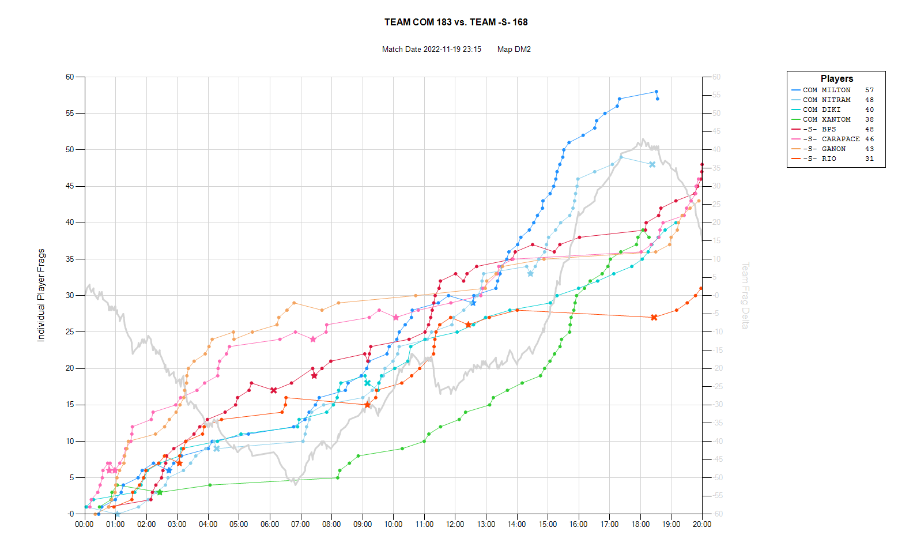

# QChart

**QChart** is a Windows application that allows visualization of Quake match dynamics using as input an MVD demo file. It's a .NET WinForms application that leverages both [MVDparser](https://github.com/QW-Group/mvdparser) and the [Windows Chart forms control](https://learn.microsoft.com/en-us/dotnet/api/system.windows.forms.datavisualization.charting?view=netframework-4.8).

This is a sample output from the application:



## How To

To run **QChart** you just need to download the latest installer from the [releases](https://github.com/delta42/qchart/releases) page. The download link will present itself under the list of assets as `QChart.zip`. Simpy download and unzip it and run `setup.exe`. If your don't already have .NET Desktop Runtime it will be downloaded and installed as a first step. Then the app will be quickly installed (to `\Program Files\delta42\QChart`), and a shortcut to `QChart` added to your Desktop.

Then all you need to do is run `QChart` and drag and drop an MVD file onto the app window, or double-click the app window to choose an MVD file by browsing to it. The chart will then get created and displayed. A PNG file also gets automatically created for each chart generation, next to the MVD file.

You can also run it on the command line, with these options:

```
Usage: QChart [OPTIONS]+
Creates a chart from a Quake MVD demo file.
If no file is specified, a UI is shown to allow file selection.

Options:
  -f, -file=VALUE           Specify MVD file to process

  -e, -exitwhendone         Exit the app once the chart has been generated

  -k, -keeplogs             Do not delete temporary logs

  -h, -help                 Show this message and exit


Note that the exitwhendone option is only applicable when a file has been specified.
If log files are kept, they will be in /Users/[USER]/AppData/Local/Temp.
```

For example, if you just want the chart image and nothing else, run:

`"C:\Program Files\delta42\QChart\QChart.exe" -file="sample.mvd" -exitwhendone`

or process a whole folder of demos files like this from a batch file:

`FOR %%f IN (*.mvd) DO "C:\Program Files\delta42\QChart\QChart.exe" -file="%%f" -exitwhendone`

## The Future

Here are some short term goals.

* Research how we can incorporate deaths into the chart data.
* Research how other interesting metadata can be visualized in the same chart: e.g., Quad, Pent.
* When running automatically with a specific file and `exitwhendone`, render in memory instead of the screen to remove the need for any UI at all.
* Add more error checks to catch unexpected inputs - so far testing has been focussed on the 4 on 4 matches from [GetQuad! Draft 6](https://badplace.eu/tournament/getquad6) and a few 4 on 4 matches from [QHLan 2022](https://www.quakeworld.nu/wiki/QHLAN2022/4on4).
* Do testing for 1 on 1 and 2 on 2 matches.
* Do testing for FFA MVD files and add support for them.
* Hopefully get feedback from users and incorporate new ideas!

## Current Design

* Once the user selects an MVD file, an `mvdparser.exe` process is spawned with the MVD path as a parameter. This will generate a series of log files in the user's Windows temp folder. We get the map name from `[MVDPath]-map.log` and the match date from `[MVDPath]-demo.log`. These are then used as the graph title.
* We then loop across all `[MVDPath]-[N]-events.log` files for values of N from 0 to 31: the data within forms the basis of the chart lines.
* The default `template.dat` file from MVDparser was modified to log FRAG events instead of DEATH event, so that now a typical even log will look like this:

```
matchtime=47.8742;player=8;frags=1;suicides=0;teamkills=0;type=FRAG;name=hangtime;team=muta
matchtime=84.9404;player=8;frags=2;suicides=0;teamkills=0;type=FRAG;name=hangtime;team=muta
matchtime=108.349;player=8;frags=3;suicides=0;teamkills=0;type=FRAG;name=hangtime;team=muta
...
```

* From each event log we create a `PlayerSession` instance that contains the player's Name, Team and an array of events containing the `matchtime`, `frags`, `suicides` and `teamkills`.
* Each of the `PlayerSessions` are then charted with matchtime on the X-Axis and `frags` on the Y-Axis.
* The X symbol on the chart identifies a `suicide` and the star symbol a `teamkill`. Note that it is possible to have multiple flags for an event; for example, one can have a `frag` and a `teamkill` simultaneously. For this reason we adopt a priority approach whereby `frags` have priority over `suicides` which have priority over `teamkills`, as far as the chart symbol used is concerned.
* Colors for each graph series are chosen from a list of fixed colors. The winning team is given colors from a blue-green palette while the losing team from a red-orange one.
* A legend is added to the chart listing all players, their line colors and final scores. The list is sorted by winning team and then highest final score.
